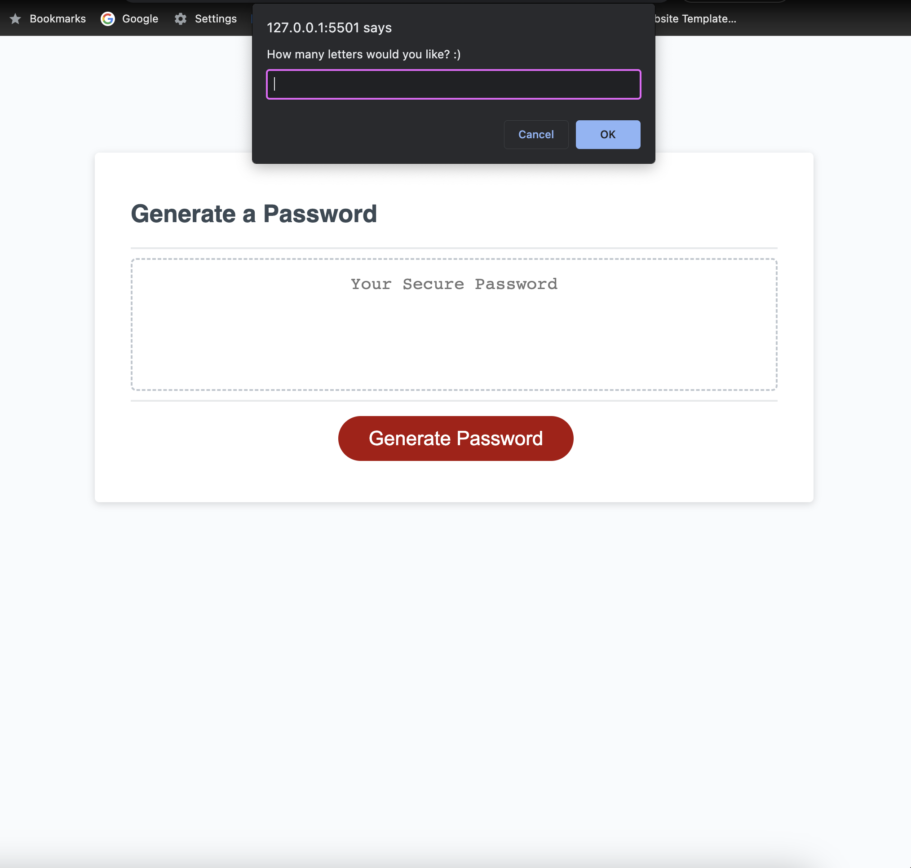
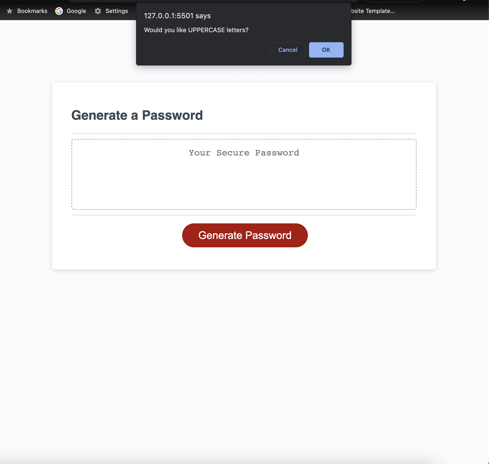
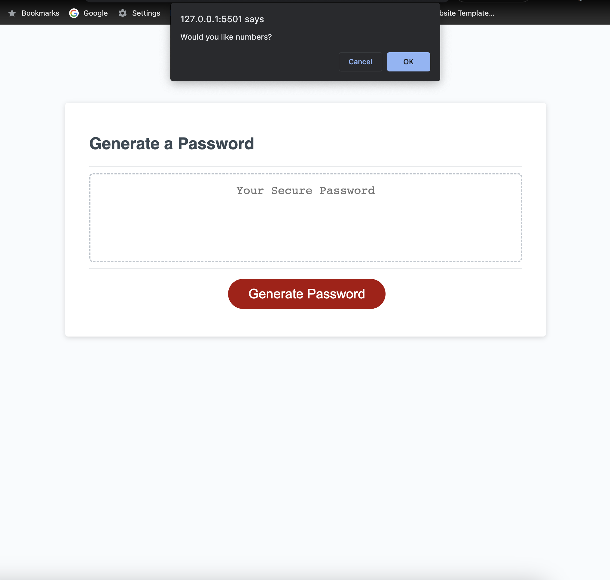
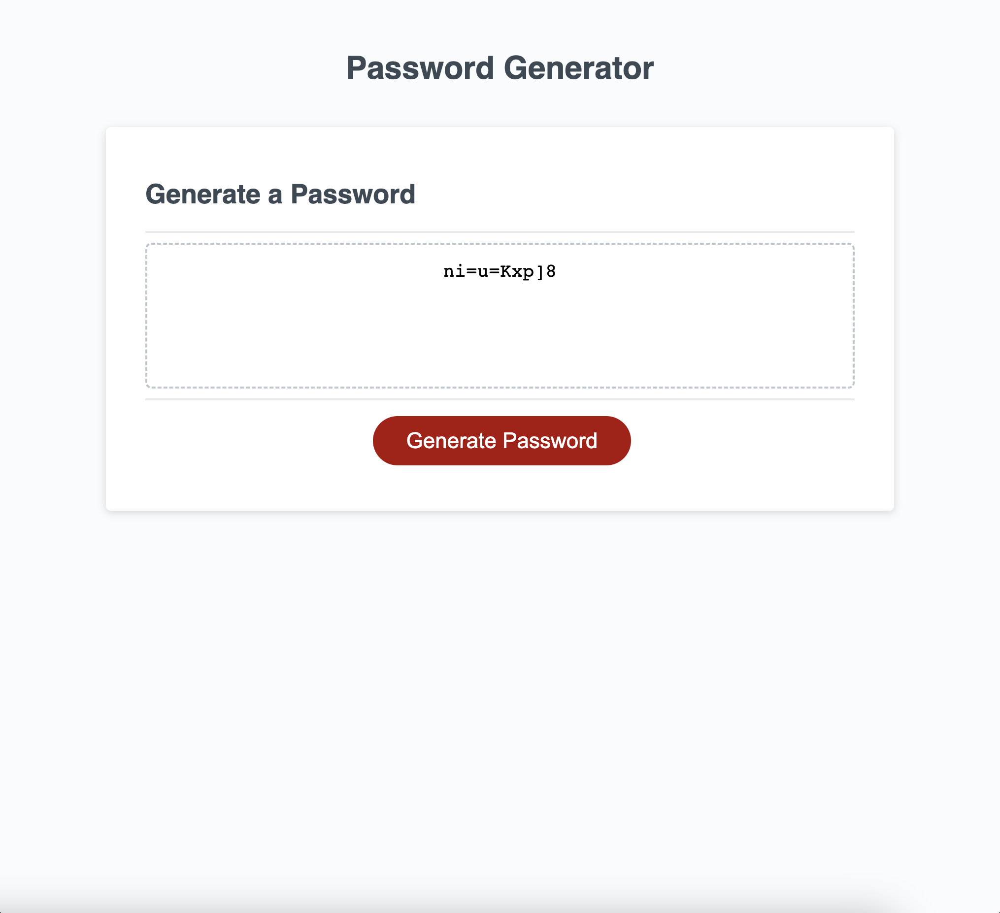
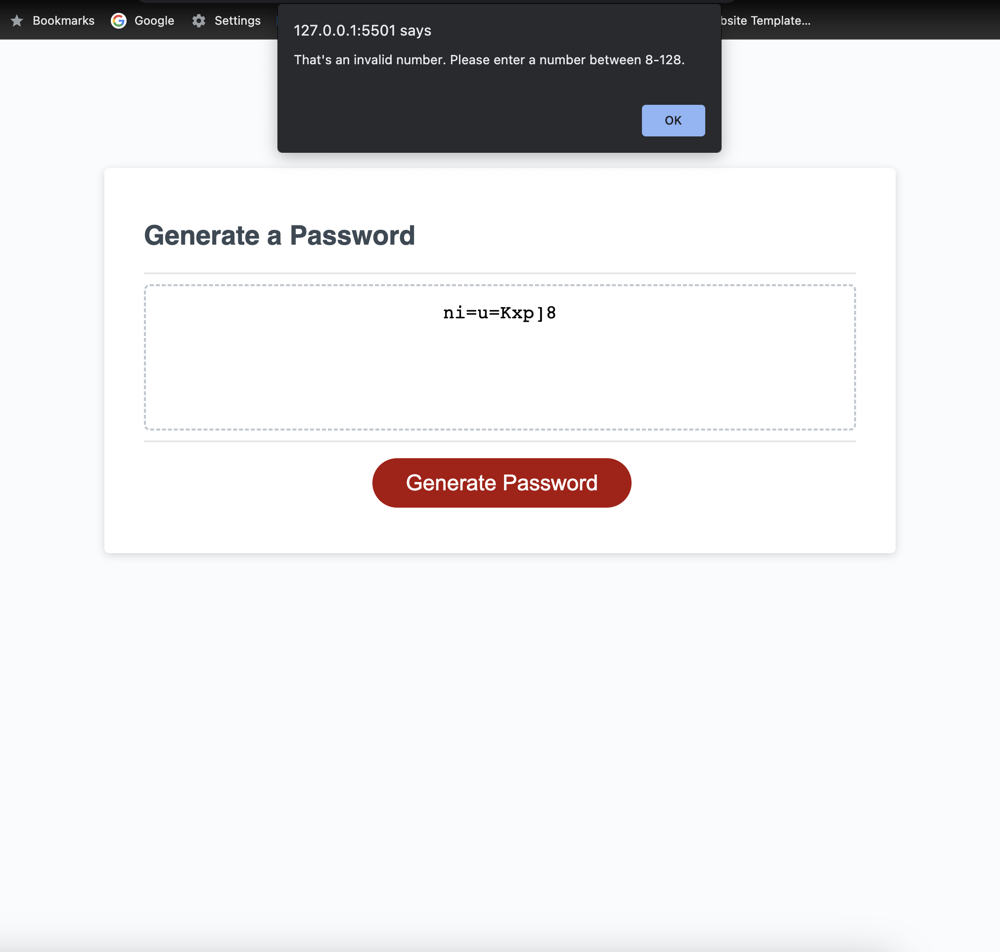
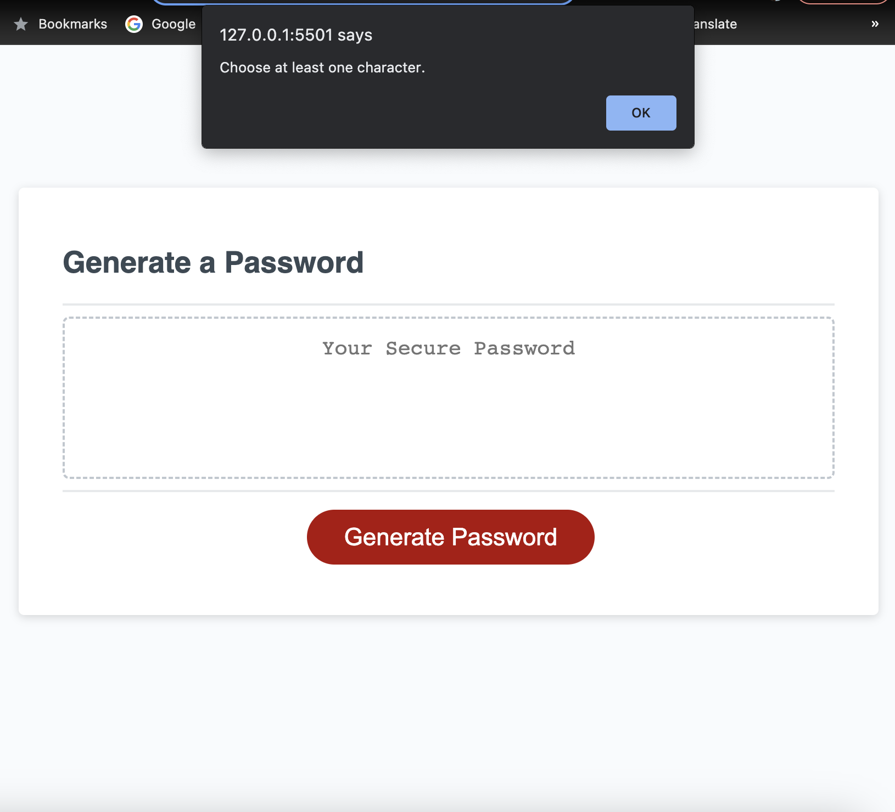

# Password-Generator

## Description

A password generator that generates a random password depending on the character choices that the user chooses through the pop-ups. 

## First Question

## Second Question

## Third Question

## Fourth Question

## Fifth Question

## Generated Password

## Alerts

## Link    

https://github.com/teresarod11/Password-Generator.git